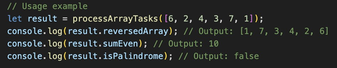
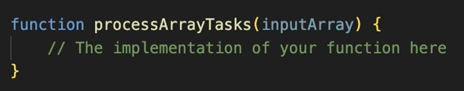

# Techstac-test-task

# *use classic JavaScript to write your code.

# Task Description:
You are tasked with creating a JavaScript function called `processArrayTasks`
that performs the following operations on an input array:

1. # Reverse the Array:
Reverse the elements of the input array. Implement the reverse operation manually without using any array methods.
2. # Selective Even Sum: 
Calculate the sum of even numbers in the input array only if their position in the original array is also even.
3. # Check for Palindrome: 
Determine if the input array is a palindrome.

# Guidelines:
* Implement the `processArrayTasks` function to achieve the specified tasks.
* The function should return the object with the following fields:
`reversedArray`, `sumEven`, and `isPalindrome`.
* Ensure your function works correctly with various input arrays.
* Test your function with the provided example and additional test cases of your own.
* The code should be placed in the attached file with.txt extension.

* Example:

# Notice!
Function code mustn’t contain `alert()` or `throw`;

An example of the file that should be attached to the email:
# File name: `Firstname_Lastname.txt`
# Content:

